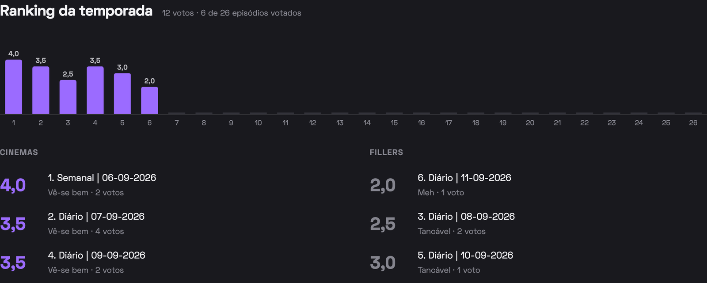
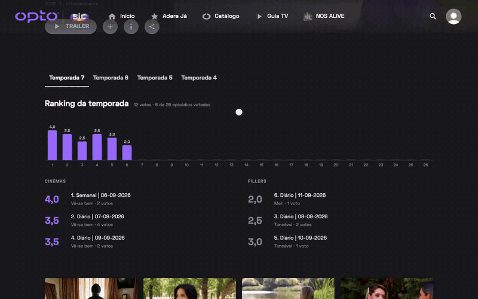
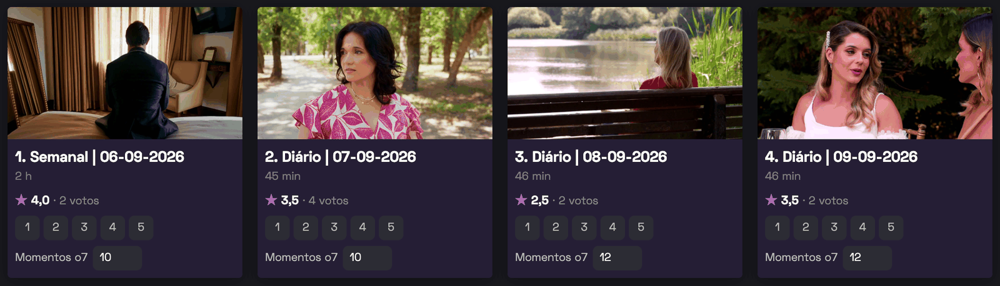
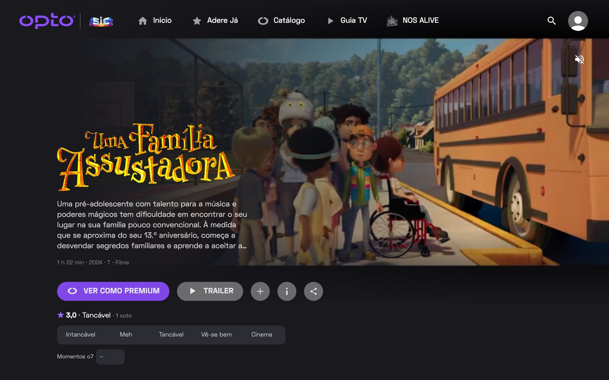

# Opto Rank

Browser extension that lets anyone rate episodes and movies on [opto.sic.pt](https://opto.sic.pt), keep a shared count of "Momentos o7", and see everyone's results. No login.

Built for *Casados à Primeira Vista*, works on every series and movie on Opto.



| 1 | 2 | 3 | 4 | 5 |
|---|---|---|---|---|
| Intancável | Meh | Tancável | Vê-se bem | Cinema |

## How to use it

### Rate an episode

Open any series. Every episode card gets the average rating, a 1–5 picker and the shared **Momentos o7** box. Click a number to vote (click another to change it). Type a number in Momentos o7 and press Enter to save it for everyone.





### Season ranking

Above the episode list:

- **Average per episode:** a bar chart for the selected season. Hover a bar for the details, click it to open the episode.
- **Cinemas:** the 3 best-rated episodes.
- **Fillers:** the 3 worst-rated episodes.

### At the end of an episode

In the last 2 minutes of an episode or movie, a box asks for your rating and Momentos o7. It also works in fullscreen. If you already voted, your rating is pre-selected. Click outside it, press Esc or ✕ to close it.


### Movies

Movie pages get the average and the rating strip under the action buttons.



## Rules

- **One vote per install per episode.** There is no login: each install gets a random anonymous ID. Voting again changes your vote.
- **Momentos o7 is one shared number (0–99) per episode.** Anyone can change it and the last edit wins. Clear the box to remove it. Every change is logged in the `momentEdits` table (install, old → new value), so vandalism can be reverted.
- **Rate limits per install:** 30 votes per minute, 300 per hour, and 30 Momentos o7 changes per hour.
- **Unreleased episodes can't be rated.** The first vote on an episode is checked against Opto's API: the episode must exist and already be released.

## How it works

```
extension/        Chrome MV3, plain JS, no build step
  content.js      reads Opto's public API (/api/v1/content/item/...) to map cards → episode IDs, injects the UI
  content.css     styles, matched to Opto's dark UI
  background.js   creates the anonymous per-install deviceId, calls Convex over HTTP
  config.js       Convex deployment URL
convex/           backend (Convex)
  schema.ts       contents (averages + shared Momentos o7 per episode) · votes (one per deviceId+episode) · momentEdits (change log)
  ratings.ts      vote (action) · getStats (query)
docs/             README images
```

The average is updated in the same transaction as the vote, so reads never scan the votes table.

## Local development

Requires Node ≥ 20 (`nvm use` picks it up from `.nvmrc`).

```sh
npm install
npx convex dev   # local backend at http://127.0.0.1:3210
```

The extension talks to production by default. To use the local backend, set `CONVEX_URL` in `extension/config.js` to `http://127.0.0.1:3210` and add `http://127.0.0.1:3210/*` to `host_permissions` in `extension/manifest.json` (don't commit those two changes).

Then in Chrome go to `chrome://extensions` → enable **Developer mode** → **Load unpacked** → choose the `extension/` folder, and open any series on Opto.

After changing the extension, press reload on its card in `chrome://extensions` **and refresh the Opto tab**. Until the tab is refreshed, the old script can't reach the extension and votes fail with "A extensão foi atualizada".

## Deploying

- **Backend:** `npx convex deploy` pushes `convex/` to production (`https://agreeable-antelope-656.eu-west-1.convex.cloud`).
- **Extension:** `npm run zip` builds `dist/opto-rank-<version>.zip`. Bump `version` in `extension/manifest.json` for each release.

## Sharing with testers

- **Quickest (friends):** send the zip. Testers unzip it, then in `chrome://extensions` turn on Developer mode → **Load unpacked** → pick the unzipped folder. No auto-updates: send a new zip for each change.
- **Proper:** publish it **Unlisted** on the Chrome Web Store. Only people with the link can install it, and it updates automatically. Everything for the listing is in [`store/`](store/): screenshots, promo tile and [`store/LISTING.md`](store/LISTING.md) with the description, permission justifications and privacy answers to paste. The privacy policy is [`PRIVACY.md`](PRIVACY.md). You need a $5 one-time developer account, and review usually takes a few days.
